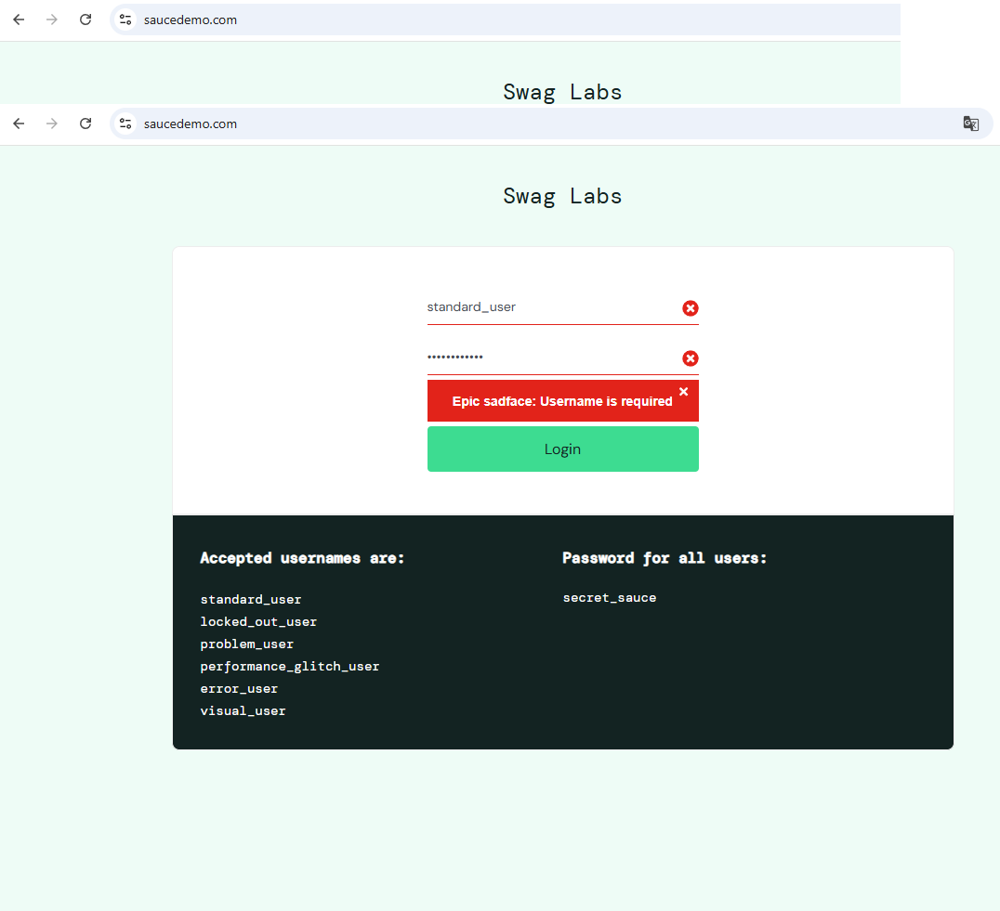

# BUG-AUTH-001 — Login validation error remains visible after user updates credentials

## Application under test

https://www.saucedemo.com

---

# Bug Summary

Login validation error remains visible, after user update the username or password field.

---

# Environment

| Component | Details |
|---|---|
| Browser | Google Chrome |
| Operating System | Windows 11 |
| Testing Type | Manual Testing |

---

# Severity

Low

---

# Priority

Medium

---

# Test Data

| Username | Password |
|---|---|
| standard_user | secret_sauce |

---

# Preconditions

1. User is on the login page

---

# Steps to Reproduce

1. Open login page
2. Click Login button without entering username
3. Verify validation error is displayed
4. Enter valid username and password
5. Verify validation error visibility

---

# Expected Result

Validation message is cleared after user updates the required fields.

---

# Actual Result

Validation error remains visible after user updates the required fields.

---

# Status

Open

# Attachments

---