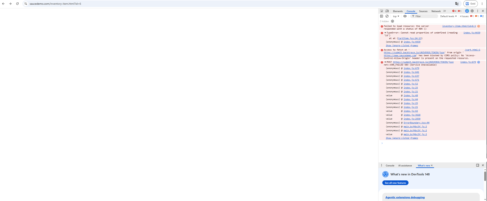

# BUG-CART-001 — Shopping cart page returns 503 error after adding invalid product
## Application under test
https://www.saucedemo.com

---

# Bug Summary

Proceeding to the shopping cart after adding an invalid product results in a 503 (Service Unavailable) error.

---

# Environment

| Component | Details |
|---|---|
| Browser | Google Chrome |
| Operating System | Windows 11 |
| Testing Type | Manual Testing |

---

# Severity

Critical

---

# Priority

High

---

# Test Data

| Username | Password |
|---|---|
| problem_user | secret_sauce |

---

# Preconditions

1. User is logged in

---

# Steps to Reproduce

1. Navigate to invalid product page (/inventory-item.html?id=6)
2. Click "Add to cart" button
3. Proceed to the shopping cart
4. Observe application behavior

---

# Expected Result

User is redirected to functional shopping cart page and selected product is visible in the shopping cart item list.

---

# Actual Result

Shopping cart page is unavailable and multiple errors are displayed in the browser console, including error codes 404, 503 (Service Unavailable), index.js TypeError, CORS error.

# Error log

503 (Service Unavailable)  
TypeError: Cannot read properties of undefined (reading 'id')  
Failed to load resource: the server responded with a status of 404 ()

---

# Status

Open

# Attachments

---