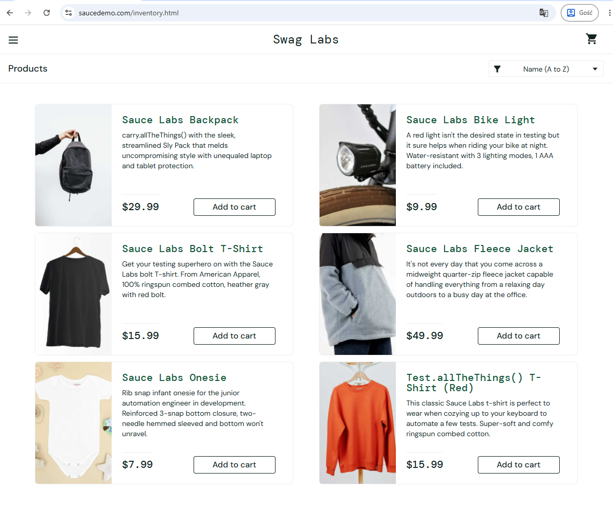

# BUG-INVENTORY-001 — Product titles and descriptions display raw JavaScript code on the inventory page

## Application under test
https://www.saucedemo.com

---

# Bug Summary

Raw JavaScript code is displayed within product titles and descriptions on the inventory page instead of valid product information.

---

# Environment

| Component | Details |
|---|---|
| Browser | Google Chrome |
| Operating System | Windows 11 |
| Testing Type | Manual Testing |

---

# Severity

Medium

---

# Priority

High

---

# Test Data

| Username | Password |
|---|---|
| standard_user | secret_sauce |

---

# Preconditions

1. User is logged in
2. Inventory page is accessible

---

# Steps to Reproduce

1. Open inventory page
2. Verify displayed product titles and descriptions

---

# Expected Result

Product titles and descriptions contain valid product information and are rendered correctly without raw code visible.

---

# Actual Result

Raw JavaScript code is visible within some product titles and descriptions on the inventory page instead of valid product information.

---

# Status

Open

# Attachments

---