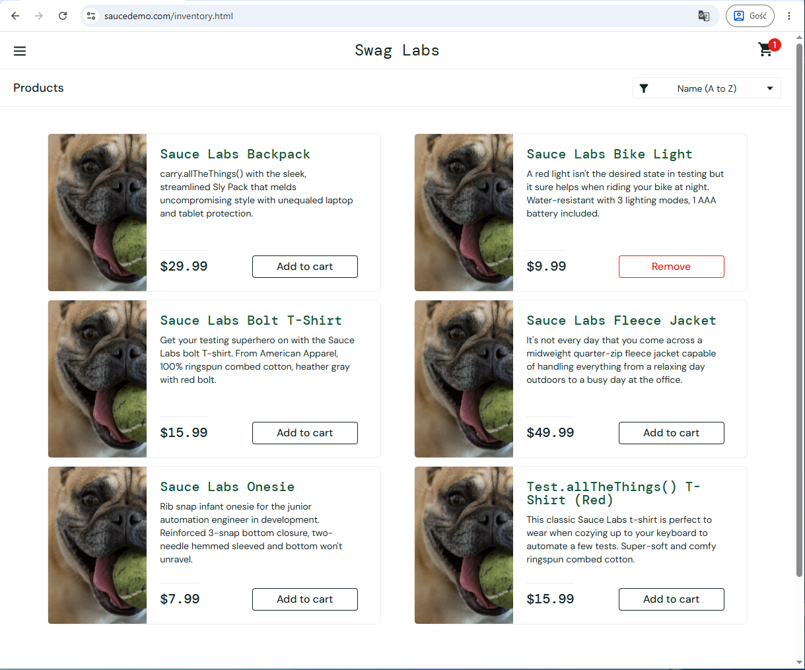

# BUG-INVENTORY-003 — Product images on the inventory page are replaced with incorrect assets

## Application under test
https://www.saucedemo.com

---

# Bug Summary

Incorrect assets are displayed instead of proper product images on the inventory page.

---

# Environment

| Component | Details |
|---|---|
| Browser | Google Chrome |
| Operating System | Windows 11 |
| Testing Type | Manual Testing |

---

# Severity

High

---

# Priority

High

---

# Test Data

| Username | Password |
|---|---|
| problem_user | secret_sauce |

---

# Preconditions

1. User is logged in

---

# Steps to Reproduce

1. Open inventory page
2. Verify product images are displayed correctly and match corresponding products

---

# Expected Result

Product images are visible and match corresponding products.

---

# Actual Result

Incorrect assets are displayed instead of corresponding product images.

---

# Status

Open

# Attachments

---