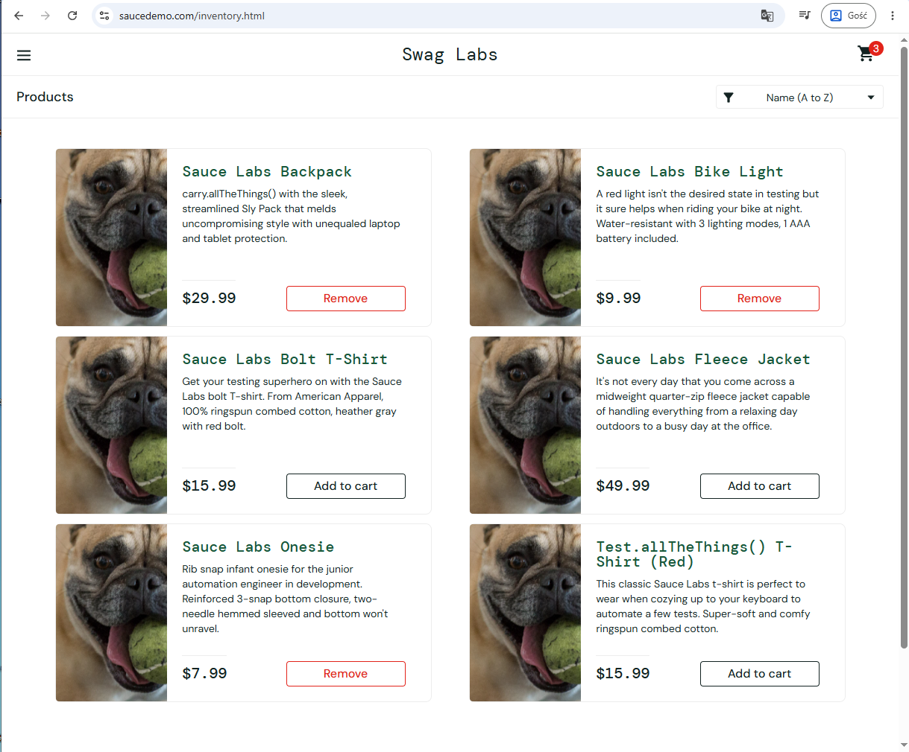
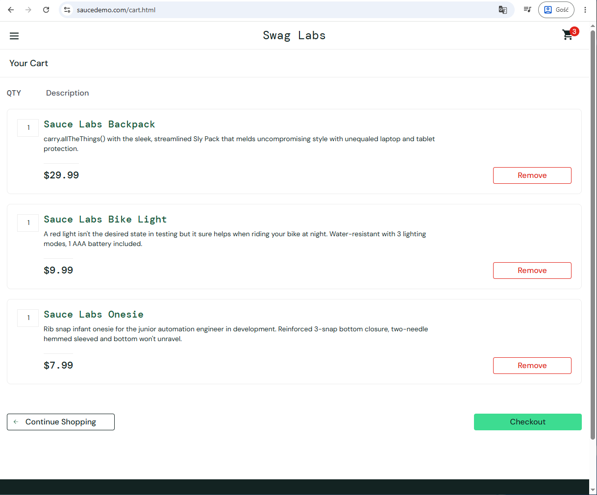

# BUG-INVENTORY-004 — Some products cannot be added to shopping cart using "Add to cart" button
## Application under test
https://www.saucedemo.com

---

# Bug Summary

Some products cannot be added to the shopping cart because corresponding "Add to cart" buttons do not respond.

---

# Environment

| Component | Details |
|---|---|
| Browser | Google Chrome |
| Operating System | Windows 11 |
| Testing Type | Manual Testing |

---

# Severity

High

---

# Priority

High

---

# Test Data

| Username | Password |
|---|---|
| problem_user | secret_sauce |

---

# Preconditions

1. User is logged in

---

# Steps to Reproduce

1. Open inventory page
2. Verify product list is visible
3. Click "Add to cart" button for each displayed product
4. Verify selected products are added to the shopping cart
---

# Expected Result

All selected products are added to the shopping cart and corresponding "Add to cart" buttons change to "Remove".

---

# Actual Result

Some "Add to cart" buttons do not respond and corresponding products cannot be added to the shopping cart.

---

# Status

Open

# Attachments

---