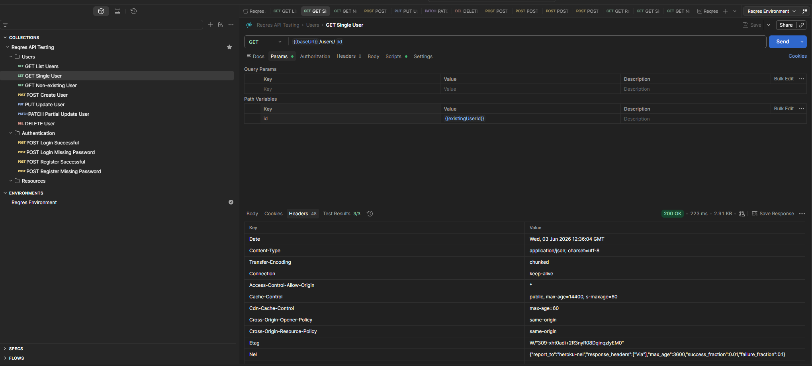

# Reqres Postman API Tests

This folder contains Postman collection and environment files used for testing the Reqres public REST API.

API under test:

https://reqres.in

---

## Files

| File | Description |
|---|---|
| collection/reqres-api-collection.json | Postman collection with API requests and test scripts |
| environment/reqres-environment.json | Postman environment with variables used by the collection |

---

## Requirements

To run these API tests, the following tool is required:

- Postman

---

## Environment Variables

The collection uses the following environment variables:

| Variable | Description |
|---|---|
| baseUrl | Base API URL |
| existingUserId | Existing user ID used in positive tests |
| nonExistingUserId | Non-existing user ID used in negative tests |
| validEmail | Email used for login and register requests |
| validPassword | Password used for successful login |
| registerPassword | Password used for successful registration |
| apiKey | API key required by Reqres |

---

## How to Import

1. Open Postman
2. Click `Import`
3. Import the collection file:

```text
collection/reqres-collection.json
```

4. Import the environment file:

```text
environment/reqres-environment.json
```

5. Select `Reqres Environment` as the active environment

---

## API Key

Reqres requires an API key to execute requests.

Before running the collection, update the `apiKey` variable in the environment.

---

## How to Run Tests

1. Open Postman
2. Select the `Reqres API Testing` collection
3. Click `Run`
4. Select `Reqres Environment`
5. Run the full collection
6. Verify that all tests pass

---

## Expected Result

The collection should complete with all tests passed.

Current test coverage includes:

- Users endpoints
- Authentication endpoints
- Resources endpoints
- Positive scenarios
- Negative scenarios
- Status code validation
- JSON response validation
- Required field validation

---

## Test Results

Latest test execution results are stored in:

```text
../test-results/reqres-postman-test-results.md
```

---

## Notes

The collection was created for QA portfolio purposes. It demonstrates basic API testing skills using Postman, environment variables, request payloads, status code assertions and response body validation.

## Attachments

