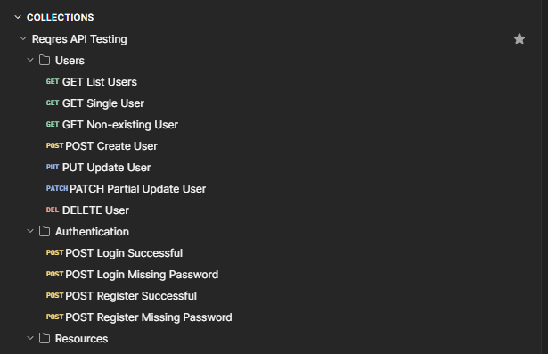

# Reqres Postman Collection

This folder contains the Postman collection file used for testing the Reqres public REST API.

---

# Collection File

The collection file contains API requests, request bodies, headers and test scripts used to validate Reqres API behavior.

[Open Reqres API Collection JSON](./reqres-collection.json)

---

# Collection Structure

The collection is organized into the following areas:

| Folder | Description |
|---|---|
| Users | User list, single user, create, update, partial update and delete requests |
| Authentication | Login and register positive and negative scenarios |
| Resources | Resource list, single resource and non-existing resource requests |

---

# Test Coverage

The collection includes validation for:

- HTTP status codes
- Response body structure
- Required JSON fields
- Authentication token presence
- Error response handling
- Negative scenarios
- Empty response body for DELETE request

---

# Environment

This collection should be executed with the `Reqres Environment`.

# Postman Collection Screenshot

