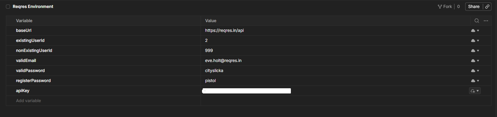

# Reqres Postman Environment

This folder contains the Postman environment file used for running Reqres API tests.

---

## Environment File

The environment file contains variables used by the Postman collection, such as base URL, user IDs, authentication data and API key placeholder.

[Open Reqres Environment JSON](./reqres-environment.json)

## Environment Variables

| Variable | Description |
|---|---|
| baseUrl | Base URL for Reqres API |
| existingUserId | Existing user ID used in positive tests |
| nonExistingUserId | Non-existing user ID used in negative tests |
| validEmail | Email used for login and register requests |
| validPassword | Password used for successful login |
| registerPassword | Password used for successful registration |
| apiKey | API key required by Reqres |

## API Key Note

Before running the collection, update the `apiKey` variable in Postman.

## Postman Environment Screenshot

