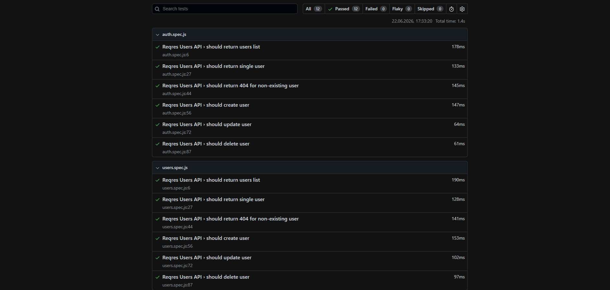

# Reqres API Automated Tests

Automated API tests for the Reqres public REST API created with Playwright and JavaScript.

This project is a code-based continuation of the Reqres API testing work prepared in Postman.

---

## Application Under Test

```text
https://reqres.in
```

Automated API tests focus on:

- HTTP status code validation
- response body validation
- required JSON field validation
- positive and negative API scenarios
- authentication endpoint validation
- reusable test structure
- test execution from command line

## Test Coverage

| Test File | Covered Area |
|---|---|
| [tests/users.spec.js](./tests/users.spec.js) | Users list, single user, non-existing user, create, update and delete user |
| [tests/auth.spec.js](./tests/auth.spec.js) | Successful login and login without password |

## Test Results
| Test File | Description |
|---|---|
| [playwright-report](./playwright-report) | Detailed HTML test report from Playwright |

## Test Scope

This project will cover selected Reqres endpoints:

| Area | Example Tests |
|---|---|
| Users | Get users list, get single user, get non-existing user |
| Authentication | Successful login, login without password |
| User Management | Create user, update user, delete user |

## Automation Approach

The tests are created based on previously prepared API testing documentation and Postman scenarios.

The workflow is:

```text
API analysis
→ test scenarios
→ Postman collection
→ automated API tests
→ test execution results
```


## Installation

```bash
npm install
```

## Running Tests

Run all tests:

```bash
npm test
```

Open HTML report:

```bash
npx playwright show-report
```

## Configuration

The project uses Reqres API base URL and API key configuration.

Private API keys are not hardcoded in the repository.

## Related Documentation

Manual API testing documentation and Postman collection are available in:

```text
02-api-testing/reqres/
```

## Tools

| Area | Tool |
|---|---|
| API Automation | Playwright |
| Programming Language | JavaScript |
| Runtime | Node.js |
| Test Runner | Playwright Test Runner |
| Version Control | Git, GitHub |


## Attachments

 