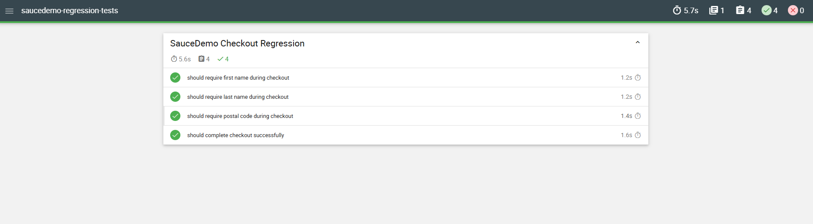

# Cypress Automation - SauceDemo Regression Tests

## Project overview

Automated UI regression tests for the SauceDemo web application using Cypress and JavaScript.

This project covers regression tests for the most important user flows in SauceDemo:

- login regression
- inventory regression
- cart regression
- checkout regression

The purpose of this project is to verify that critical application functionality still works correctly after changes.

## Tests

| Section | Description |
|---|---|
| [Cypress Tests](./cypress/e2e) | Automated regression tests created with Cypress |


## Application under test

SauceDemo:

```text
https://www.saucedemo.com/
```

## Tech stack

- JavaScript
- Cypress
- Cypress Test Runner
- Mochawesome reporter
- Cypress custom commands
- Fixtures for test data

## Test coverage

### Login regression

- should login successfully with valid credentials
- should show error for locked out user
- should show error for invalid credentials

### Inventory regression

- should display products page
- should sort products by name descending
- should sort products by price ascending

### Cart regression

- should add product to cart and update cart badge
- should display added product in cart
- should add multiple products to cart

### Checkout regression

- should require first name during checkout
- should require last name during checkout
- should require postal code during checkout
- should complete checkout successfully

## Installation

Install dependencies:

```bash
npm install
```

## Running tests

Run all tests in headless mode:

```bash
npm test
```

Open Cypress Test Runner:

```bash
npm run test:open
```

## HTML report

This project uses Mochawesome reporter.

After running tests, the HTML report is generated in:

```text
cypress/reports/
```

Example command:

```bash
npm test
```

## Test data

Test data is stored in:

```text
cypress/fixtures/test-data.json
```

## Custom commands

Reusable Cypress commands are stored in:

```text
cypress/support/commands.js
```

Current custom commands include:

- `cy.login(username, password)`
- `cy.addProductToCart(productName)`

## Attachments

 
