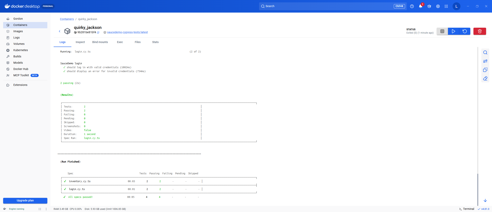

# SauceDemo - Cypress Automated Tests in Docker using TypeScript

This project contains automated end-to-end tests for the SauceDemo application using Cypress and TypeScript.

The test suite can be executed locally or inside a Docker container to provide a consistent and isolated test environment.

## Project Overview

The purpose of this project is to demonstrate:

- Cypress end-to-end test automation
- TypeScript usage in automated tests
- Typed fixture data
- Reusable helper functions
- Dockerized test execution
- Running the same test suite in a consistent environment

## Project Structure

### Test Files

| File | Description |
|---|---|
| [cypress/e2e/login.cy.ts](./cypress/e2e/login.cy.ts) | Cypress login tests covering valid and invalid credentials |
| [cypress/e2e/inventory.cy.ts](./cypress/e2e/inventory.cy.ts) | Cypress inventory tests covering adding the first product and all products to the cart |

### Test Data

| File | Description |
|---|---|
| [cypress/fixtures/users.json](./cypress/fixtures/users.json) | Test data containing valid and invalid SauceDemo users |

### TypeScript Types

| File | Description |
|---|---|
| [cypress/types/user.ts](./cypress/types/user.ts) | TypeScript definitions for users and fixture data |

### Configuration

| File | Description |
|---|---|
| [cypress.config.ts](./cypress.config.ts) | Cypress E2E configuration |
| [tsconfig.json](./tsconfig.json) | TypeScript compiler configuration |

### Docker

| File | Description |
|---|---|
| [Dockerfile](./Dockerfile) | Docker image definition used to run the Cypress test suite |

## Test Scenarios

- Successful login with valid credentials
- Error message displayed for invalid credentials
- Add the first product to the cart and verify its name
- Add all products to the cart and verify the cart item count

## Technologies

- Cypress
- TypeScript
- Node.js, npm
- Docker

## Prerequisites

For local execution:

- Node.js, npm

For Docker execution:

- Docker Desktop

## Installation

Install the project dependencies:

```bash
npm ci
```

## Run Locally

Run all Cypress tests:

```bash
npm test
```

Open Cypress in interactive mode:

```bash
npm run cy:open
```

Run TypeScript validation:

```bash
npm run typecheck
```

## Run with Docker

Build the Docker image:

```bash
docker build -t saucedemo-cypress-tests .
```

Run the test suite inside a container:

```bash
docker run saucedemo-cypress-tests
```

## Attachments


