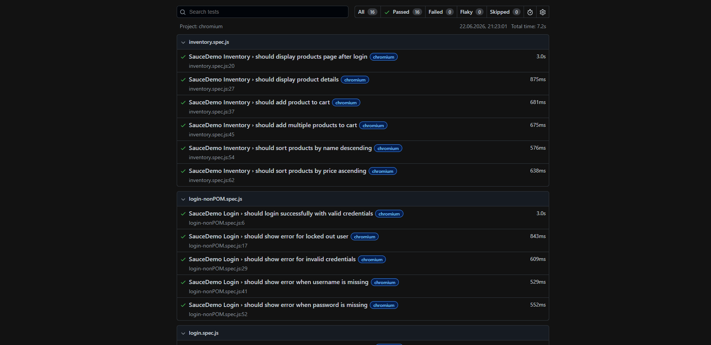

# Playwright Automation

## Project overview - SauceDemo UI Tests

UI automation tests for the SauceDemo web application using Playwright and JavaScript.

## Project scope

This project covers selected UI test scenarios for:

- login functionality
- negative login validation
- locked out user validation
- inventory page validation
- product details validation
- adding products to cart
- product sorting

The project uses the Page Object Model pattern to separate test logic from page selectors and actions.

## Application under test

SauceDemo:

```text
https://www.saucedemo.com/
```

## Test coverage

### Login tests

- should login successfully with valid credentials
- should show error for locked out user
- should show error for invalid credentials
- should show error when username is missing
- should show error when password is missing

### Inventory tests

- should display products page after login
- should display product details
- should add product to cart
- should add multiple products to cart
- should sort products by name descending
- should sort products by price ascending

## Installation

Install dependencies:

```bash
npm install
```

```bash
npx playwright install
```

## Running tests

Run all tests:

```bash
npm test
```

Run tests in headed mode:

```bash
npm run test:headed
```

Open Playwright HTML report:

```bash
npm run report
```

## Reports and test artifacts

Playwright generates test artifacts locally:

```text
playwright-report/
test-results/
```

These folders are not committed to the repository.


## Attachments
 
