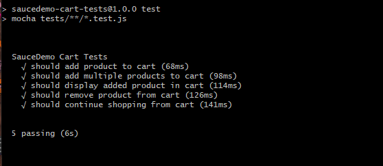

# Selenium Automation - SauceDemo Shopping Cart Tests

## Project overview 

Automated UI tests for the SauceDemo cart flow created with Selenium WebDriver.

The project uses the Page Object Model pattern to separate test logic from page selectors and actions.

## Test Scope

- login before cart
- adding a single product to cart
- adding multiple products to cart
- verifying cart item details
- removing a product from cart
- continuing shopping from cart

## Technologies used

- JavaScript
- Selenium WebDriver
- Mocha
- ChromeDriver
- Node.js assert
- Page Object Model

## Project Structure

### Test Data

| File | Description |
|---|---|
| [data/test-data.js](./data/test-data.js) | Contains test data used in Selenium tests, including user credentials and product details |

### Page Objects

| File | Description |
|---|---|
| [pages/login.page.js](./pages/login.page.js) | Page Object Model class for the SauceDemo login page |
| [pages/inventory.page.js](./pages/inventory.page.js) | Page Object Model class for the inventory page, including product selection and cart actions |
| [pages/cart.page.js](./pages/cart.page.js) | Page Object Model class for the shopping cart page, including cart item validation, product removal and continue shopping action |


### Tests

| File | Description |
|---|---|
| [tests/cart.test.js](./tests/cart.test.js) | Mocha test suite covering SauceDemo shopping cart scenarios, including adding products, verifying cart details, removing products and continuing shopping |


## How to run

Go to the project folder:

```bash
cd saucedemo-cart-tests
```

Install dependencies:

```bash
npm install
```

Run tests:

```bash
npm test
```

## Attachments

 
