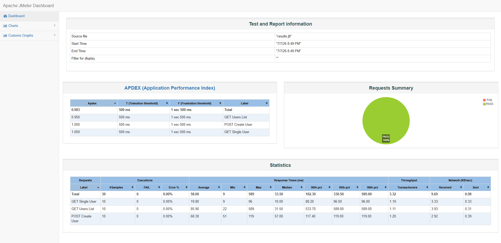

# JMeter Performance Testing - Reqres Load Test

This project contains a basic JMeter load test for the Reqres API.

The purpose of this project is to demonstrate how Apache JMeter can be used to execute simple API performance checks and generate a test report.

---

## Test Scope

The test plan covers selected Reqres API endpoints:

| Method | Endpoint | Purpose |
|---|---|---|
| GET | `/api/users?page=2` | Retrieve a list of users |
| GET | `/api/users/2` | Retrieve a single user |
| POST | `/api/users` | Create a user |

---

## Test Plan

The test plan is available here:
|---|---|
| [reqres-load-test.jmx](./test-plan/reqres-load-test.jmx) | ReqRes tests created with JMeter

## Test Results

Test result files are available here:
|---|---|
| [test results](./results) | .jtl and .html detailed test reports |

## Test Configuration

| Setting | Value |
|---|---|
| Tool | Apache JMeter |
| Protocol | HTTPS |
| Base URL | `reqres.in` |
| Number of users | 10 |
| Ramp-up period | 10 seconds |
| Loop count | 1 |


## Installation

Apache JMeter requires Java.

### 1. Verify Java installation

Check whether Java is installed:

```bash
java -version
```

If Java is not installed, install a supported Java version first.

### 2. Download Apache JMeter

Download Apache JMeter from the official Apache JMeter website.

After downloading, extract the archive to a selected location on your machine.

### 3. Start JMeter GUI

From the extracted JMeter directory, go to the `bin` folder.

On Windows:

```bash
jmeter.bat
```

On macOS/Linux:

```bash
./jmeter
```

## API Key

Reqres requires an API key to execute requests.

Before running the tests, update the `x-api-key` variable.


## How to Use This Project

### 1. Open the test plan in JMeter

Open Apache JMeter and load the test plan:

```text
test-plan/reqres-load-test.jmx
```

### 2. Run the test from JMeter GUI

Use the JMeter GUI to verify that the test plan opens correctly and that all requests are configured as expected.

For actual load test execution, command-line mode is recommended.


## Command-Line Execution HTML Report

To run the test and generate a JMeter HTML report, use:

```bash
jmeter -n -t test-plan/reqres-load-test.jmx -l results/results.jtl -e -o results/jmeter-html-report
```

Where:

| Option | Description |
|---|---|
| `-n` | runs JMeter in non-GUI mode |
| `-t` | path to the JMeter test plan |
| `-l` | path where raw test results will be saved |
| `-e` | generate HTML report |
| `-o` | path for HTML report |
---


After execution, open:

```text
results/jmeter-html-report/index.html
```

The generated HTML report contains detailed performance results, including response times, throughput, error rate and request statistics.


## Test Result Screenshot
