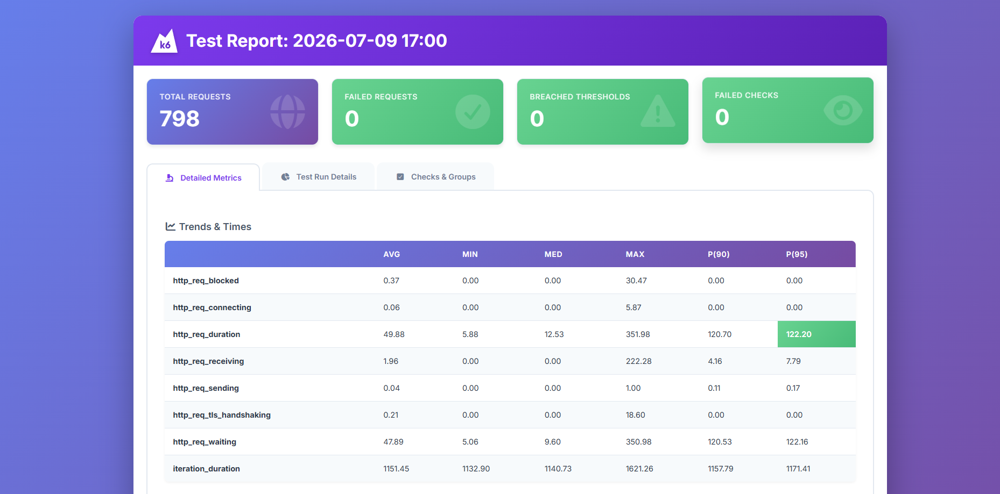

# k6 Summary Report - JSONPlaceholder API Load Test

A basic API load testing project built with k6. It validates selected JSONPlaceholder endpoints under a light load, generates text and HTML reports, and can optionally stream performance metrics to Prometheus for exploration in Grafana.

## Test Objective

The objective of this test was to perform a basic API load test using k6 and verify that selected JSONPlaceholder endpoints respond correctly under light load.

| File | Description |
|---|---|
|[jsonplaceholder-api-load-test.js](./tests/jsonplaceholder-api-load-test.js) | JSONPlaceholder API tests |
|[k6-test-plan.md](./test-plan/k6-test-plan.md) | Test Plan |

Detailed results are available here:
| File | Description |
|---|---|
|[k6-summary.txt](./results/k6-summary.txt) | Text file test report |
|[k6-html-report.html](./results/k6-html-report.html) | HTML test report |


## Scope

Tested endpoints:

- GET /posts
- GET /posts/1
- POST /posts

## Load Configuration

- Virtual users: 10
- Duration: 30 seconds
- Tool: k6
- Test type: Basic API load test

## Validations

The test validates:

- HTTP status codes
- response body structure
- basic response correctness

## Thresholds

The test fails when either threshold is exceeded:

- HTTP request failure rate below 1%
- 95% of requests should complete below 1000 ms

## Prerequisites

Install the following tools before running the project:

- k6
- Node.js and npm
- Docker Desktop with Docker Compose

Docker is required only for the Prometheus and Grafana workflow. Standard and file-log test runs use the locally installed k6 CLI.

## Installation

From the project directory, install the npm development dependency:

```bash
npm install
```

`cross-env` is used only to make the Prometheus environment variables work consistently on Windows, Linux, and macOS.

## Run the tests

### Standard load test

```bash
npm test
```

This runs the configured test with 10 virtual users for 30 seconds.

### Save k6 console logs to a file

```bash
npm run test:logs
```

The test script logs only failed groups of checks. The messages are saved to:

```text
results/k6.log
```

A successful run may produce an empty log file. k6 still prints its normal end-of-test summary and generates the text and HTML reports.

## Run with Prometheus and Grafana

### 1. Start the monitoring services

Make sure Docker Desktop is running, then execute:

```bash
npm run infra:up
```

Check their status:

```bash
npm run infra:status
```

The services are available at:

| Service | Address |
|---|---|
| Prometheus | `http://localhost:9090` |
| Grafana | `http://localhost:3000` |

### 2. Run k6 and stream metrics to Prometheus

```bash
npm run test:grafana
```

The command runs k6 locally and sends its time-series metrics to the Prometheus remote-write endpoint. The test is tagged with:

```text
testid=jsonplaceholder-local
```
### 3. Explore the k6 metrics

In Grafana, open **Explore** and select the default **Prometheus** data source. Set the time range to include the latest test and try these PromQL queries:

All k6 metrics:

```promql
{__name__=~"k6_.*"}
```

## Attachments

