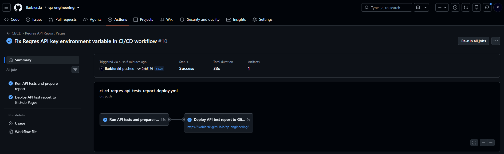

# CI/CD - Playwright Report to GitHub Pages

This project contains a GitHub Actions CD workflow that publishes a Playwright HTML report to GitHub Pages.

## Related Test Project

```text
04-test-automation/api-automation/reqres-api-tests
```

---

## Workflow File

| File | Purpose |
|---|---|
| [ci-cd-reqres-api-test-report.yml](./ci-cd-reqres-api-test-report.yml) | Runs API tests and deploys the generated report to GitHub Pages |


## What It Does

| Part | Description |
|---|---|
| CI | Installs dependencies and runs Reqres API tests |
| CD | Publishes the generated Playwright HTML report to GitHub Pages |

## Trigger

The workflow runs on:

- push to `main`
- manual run from the GitHub Actions tab


## How to run

```bash
npm ci
npm test
```

## Report Source

The deployed report is generated from:

```text
04-test-automation/api-automation/reqres-api-tests/playwright-report
```

## Deployed page
The page with Playwright test report deployed by the CI/CD workflow is available here:
| Link | URL |
|---|---|
|[CI/CD HTML Test Report URL](https://lkobierski.github.io/qa-engineering/) | lkobierski.github.io/qa-engineering/ |

## Screenshot


