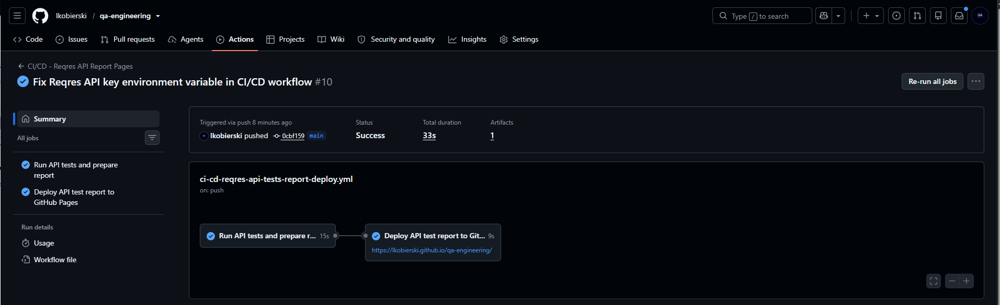

# CI - SauceDemo Playwright Tests Workflow

This project contains a GitHub Actions workflow for running Playwright UI tests.

The workflow is designed for the existing Playwright project:

```text
04-test-automation/playwright/saucedemo-ui-tests
```

## Workflow File

The workflow file is available here:
| File | Purpose |
|---|---|
| [ci-playwright-sauce-demo-tests.yml](./ci-playwright-sauce-demo-tests.yml) | Installs dependencies and runs Playwright tests on pull requests and pushes |


## What the Workflow Does

The workflow performs the following steps:

1. checks out the repository
2. sets up Node.js
3. installs project dependencies
4. installs Playwright browsers
5. runs Playwright tests


## Trigger

The workflow runs on:

- push to `main`
- pull request to `main`


## How to run

```bash
npm ci
npx playwright install --with-deps
npx playwright test
```

## Screenshot
